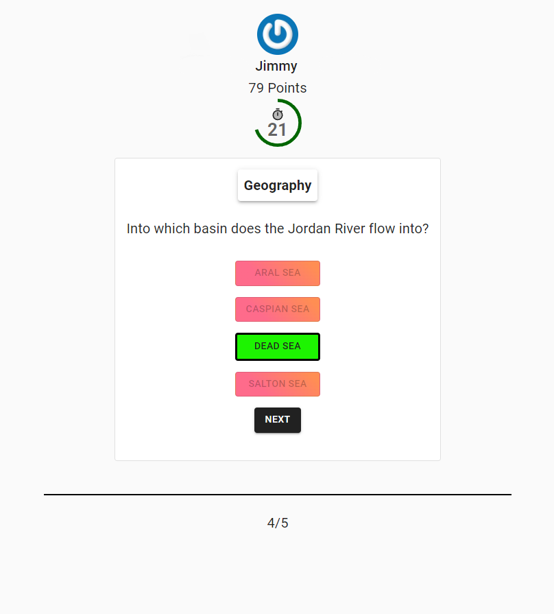
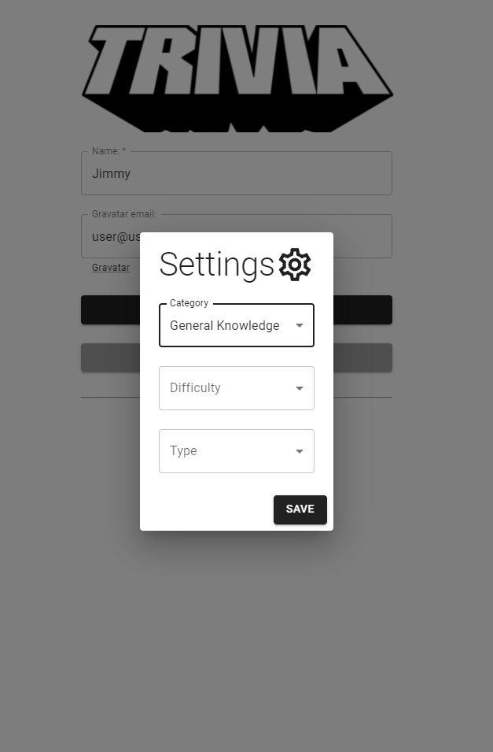

# Trivia-game React Web App

Front-end webApp build with ReactJS, Redux and Material UI using Fetch-API to grab questions from the [Open TriviaDB API](https://opentdb.com/)
- Interactive Quiz-Game using the OpenTriviaDB-API. 
- Users can filter questions based on category/difficulty and/or type.

## Live Demo
[Trivia Game Live Demo](https://matheuspor.github.io/trivia-game/).

## Main Page

## Settings Page

